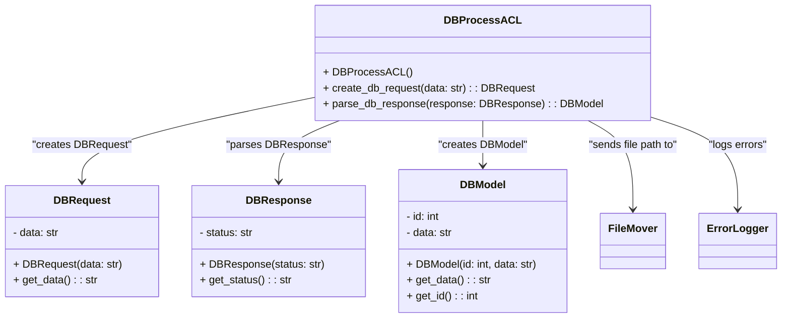

# DBProcess Class Diagram

```mermaid
classDiagram
    class DBProcessACL {
        + DBProcessACL()
        + create_db_request(data: str): DBRequest
        + parse_db_response(response: DBResponse): DBModel
    }

    class DBRequest {
        - data: str
        + DBRequest(data: str)
        + get_data(): str
    }

    class DBResponse {
        - status: str
        + DBResponse(status: str)
        + get_status(): str
    }

    class DBModel {
        - id: int
        - data: str
        + DBModel(id: int, data: str)
        + get_data(): str
        + get_id(): int
    }

    DBProcessACL --> DBRequest : "creates DBRequest"
    DBProcessACL --> DBResponse : "parses DBResponse"
    DBProcessACL --> DBModel : "creates DBModel"
    DBProcessACL --> FileMover : "sends file path to"
    DBProcessACL --> ErrorLogger : "logs errors"
```
