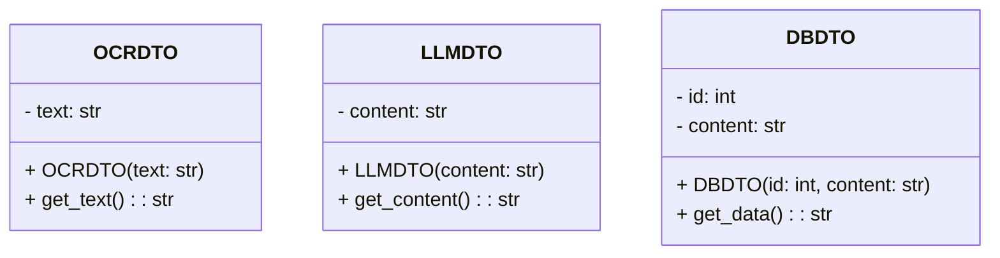

# DTOs Diagram

```mermaid
classDiagram
    class OCRDTO {
        - text: str
        + OCRDTO(text: str)
        + get_text(): str
    }

    class LLMDTO {
        - content: str
        + LLMDTO(content: str)
        + get_content(): str
    }

    class DBDTO {
        - id: int
        - content: str
        + DBDTO(id: int, content: str)
        + get_data(): str
    }
```
