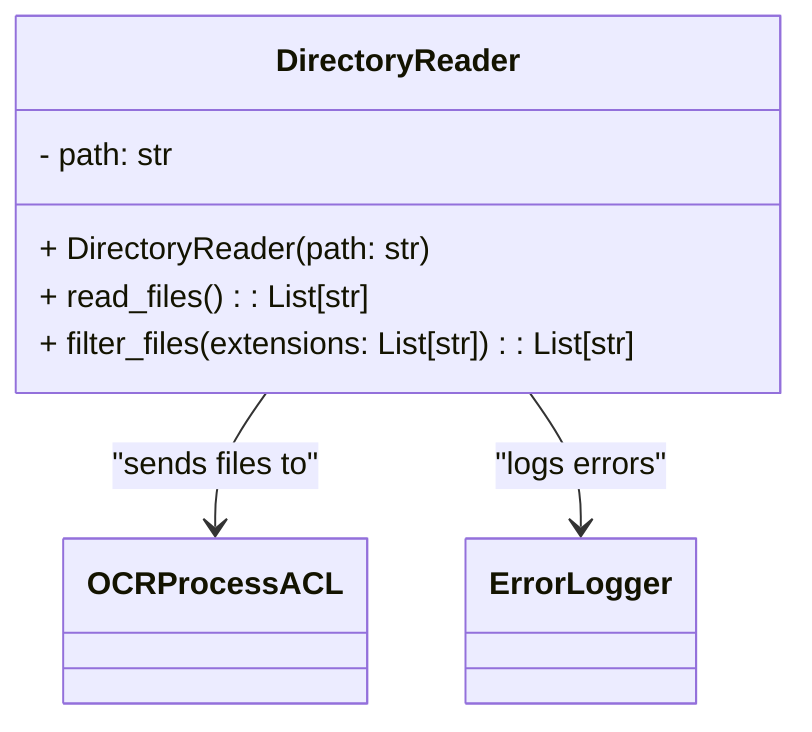

# DirectoryReader Class Diagram

```mermaid
classDiagram
    class DirectoryReader {
        - path: str
        + DirectoryReader(path: str)
        + read_files(): List[str]
        + filter_files(extensions: List[str]): List[str]
    }

    DirectoryReader --> OCRProcessACL : "sends files to"
    DirectoryReader --> ErrorLogger : "logs errors"
```
