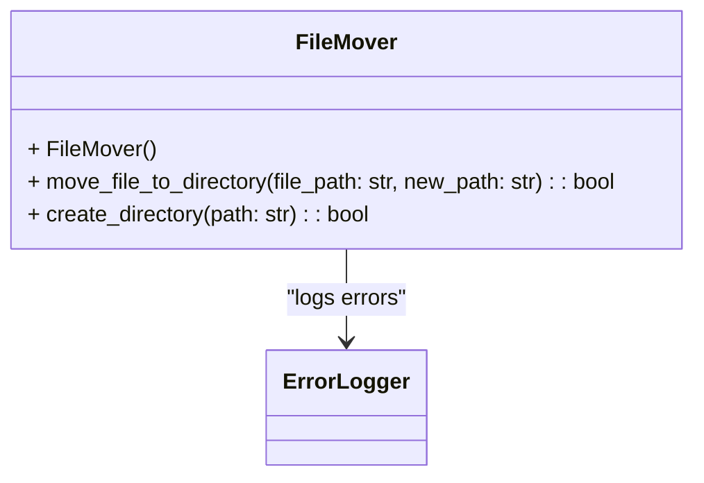

# FileMover Class Diagram

```mermaid
classDiagram
    class FileMover {
        + FileMover()
        + move_file_to_directory(file_path: str, new_path: str): bool
        + create_directory(path: str): bool
    }

    FileMover --> ErrorLogger : "logs errors"
```
