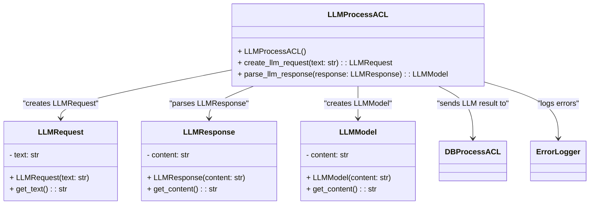

# LLMProcess Class Diagram

```mermaid
classDiagram
    class LLMProcessACL {
        + LLMProcessACL()
        + create_llm_request(text: str): LLMRequest
        + parse_llm_response(response: LLMResponse): LLMModel
    }

    class LLMRequest {
        - text: str
        + LLMRequest(text: str)
        + get_text(): str
    }

    class LLMResponse {
        - content: str
        + LLMResponse(content: str)
        + get_content(): str
    }

    class LLMModel {
        - content: str
        + LLMModel(content: str)
        + get_content(): str
    }

    LLMProcessACL --> LLMRequest : "creates LLMRequest"
    LLMProcessACL --> LLMResponse : "parses LLMResponse"
    LLMProcessACL --> LLMModel : "creates LLMModel"
    LLMProcessACL --> DBProcessACL : "sends LLM result to"
    LLMProcessACL --> ErrorLogger : "logs errors"
```
