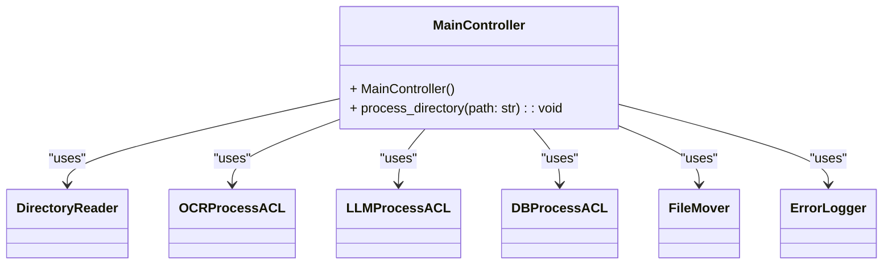

# MainController Class Diagram

```mermaid
classDiagram
    class MainController {
        + MainController()
        + process_directory(path: str): void
    }

    MainController --> DirectoryReader : "uses"
    MainController --> OCRProcessACL : "uses"
    MainController --> LLMProcessACL : "uses"
    MainController --> DBProcessACL : "uses"
    MainController --> FileMover : "uses"
    MainController --> ErrorLogger : "uses"
```
