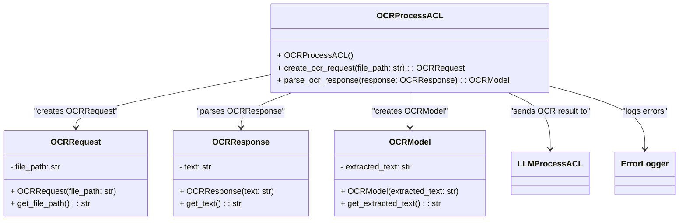

# OCRProcess Class Diagram

```mermaid
classDiagram
    class OCRProcessACL {
        + OCRProcessACL()
        + create_ocr_request(file_path: str): OCRRequest
        + parse_ocr_response(response: OCRResponse): OCRModel
    }

    class OCRRequest {
        - file_path: str
        + OCRRequest(file_path: str)
        + get_file_path(): str
    }

    class OCRResponse {
        - text: str
        + OCRResponse(text: str)
        + get_text(): str
    }

    class OCRModel {
        - extracted_text: str
        + OCRModel(extracted_text: str)
        + get_extracted_text(): str
    }

    OCRProcessACL --> OCRRequest : "creates OCRRequest"
    OCRProcessACL --> OCRResponse : "parses OCRResponse"
    OCRProcessACL --> OCRModel : "creates OCRModel"
    OCRProcessACL --> LLMProcessACL : "sends OCR result to"
    OCRProcessACL --> ErrorLogger : "logs errors"
```
