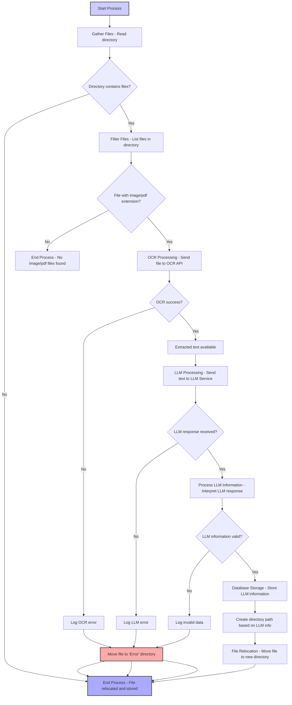

```mermaid
flowchart TD
    %% Use Case 1: Gather Files
    A[Start Process] --> B[Gather Files - Read directory]
    B --> C{Directory contains files?}

    %% EdgeCase: Directory empty
    C -- No --> Z[End Process - Directory is empty]

    %% Use Case 2: Filter Files
    C -- Yes --> D[Filter Files - List files in directory]
    D --> E{File with image/pdf extension?}

    %% EdgeCase: No files
    E -- No --> Y[End Process - No image/pdf files found]

    %% Use Case 3: OCR Processing
    E -- Yes --> F[OCR Processing - Send file to OCR API]
    F --> G{OCR success?}

    %% EdgeCase: OCR Error
    G -- No --> F1[Log OCR error]
    F1 --> H[Move file to 'Error' directory]
    H --> Z[End Process - File moved to 'Error' directory]

    %% Redirect to LLM Processing
    G -- Yes --> I[Extracted text available]
    I --> J[LLM Processing - Send text to LLM Service]
    J --> K{LLM response received?}

    %% EdgeCase: LLM Error
    K -- No --> K1[Log LLM error]
    K1 --> H[Move file to 'Error' directory]
    H --> Z[End Process - File moved to 'Error' directory]

    %% Use Case 4: Process LLM Information
    K -- Yes --> L[Process LLM Information - Interpret LLM response]
    L --> M{LLM information valid?}

    %% EdgeCase: Error result from LLM
    M -- No --> M1[Log invalid data]
    M1 --> H[Move file to 'Error' directory]
    H --> Z[End Process - File moved to 'Error' directory]

    %% Use Case 5: Store and Move Files
    M -- Yes --> N[Database Storage - Store LLM information]
    N --> O[Create directory path based on LLM info]
    O --> P[File Relocation - Move file to new directory]

    %% End
    P --> Z[End Process - File relocated and stored]

    %% Style
    style A fill:#ccf,stroke:#333,stroke-width:2px
    style Z fill:#aaf,stroke:#333,stroke-width:2px
    style H fill:#faa,stroke:#333,stroke-width:2px
```
